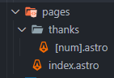

# Frontend Mentor - Interactive rating component solution

This is a solution to the [Interactive rating component challenge on Frontend Mentor](https://www.frontendmentor.io/challenges/interactive-rating-component-koxpeBUmI). Frontend Mentor challenges help you improve your coding skills by building realistic projects. 

## Table of contents

- [Overview](#overview)
  - [The challenge](#the-challenge)
  - [Screenshot](#screenshot)
  - [Links](#links)
- [My process](#my-process)
  - [Built with](#built-with)
  - [What I learned](#what-i-learned)
  - [Continued development](#continued-development)

## Overview

### The challenge

Users should be able to:

- View the optimal layout for the app depending on their device's screen size
- See hover states for all interactive elements on the page
- Select and submit a number rating
- See the "Thank you" card state after submitting a rating

### Screenshot


### Links

- Solution URL: [WEB](https://your-solution-url.com)
- Live Site URL: [GITHUB](https://your-live-site-url.com)

## My process

### Built with

- Semantic HTML5 markup
- CSS custom properties
- Flexbox
- CSS Grid
- Mobile-first workflow
- [Tailwind](https://tailwindcss.com/) - CSS framework
- [Astro](https://astro.build/) - HTML framework

### What I learned


I learned how to create pages




Here I had to generate the static pages
```js
export function getStaticPaths() {
  return [
    {params: {num: '1'}},
    {params: {num: '2'}},
    {params: {num: '3'}},
    {params: {num: '4'}},
    {params: {num: '5'}},
  ];
}
```


Here I learned to capture the parameters
```js
const { num } = Astro.params
```

### Continued development

Continue creating bigger apps and learning more technologies